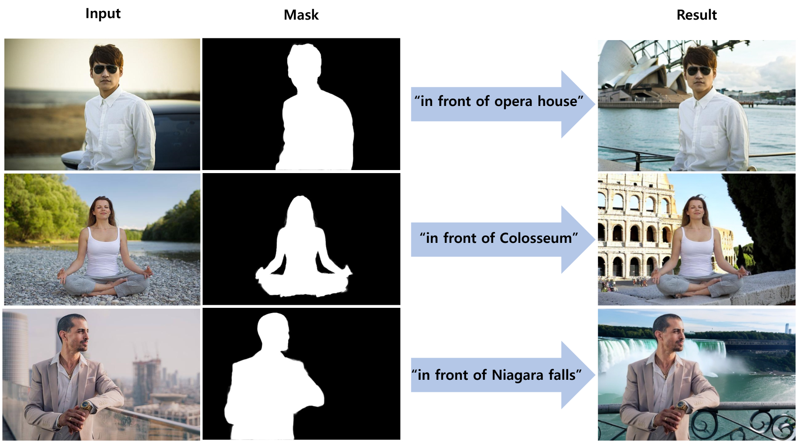

# ToAnywhere
Change the background **to anywhere** you wan to visit  
- 이기정, 류다윤, 위성진, 임서영, 최다희, 표솔빈, 한진모,
- Project for [투빅스 제16회 인공지능 컨퍼런스](http://www.datamarket.kr/xe/board_lhOx96/84733)
- [[Website](https://web-convimg-7xwyjq992llizmajzo.sel4.cloudtype.app/)] [[Tobig's](http://www.datamarket.kr/xe/page_SKdp53)]


- Automatically generates a high-quality mask of the person in the image
- Changes the background of image to the place in the text prompt.
- The new background will be **realistic, high quality, harmonious with the person's pose and lighting**

## Installation
Requires `python>=3.8`
```
python -m venv .venv
source .venv/bin/activate
pip install torch torchvision
pip install -r requirements.txt
```

## Model Checkpoints
1. Download **SAM-VIT-L** checkpoint provided in [segment-anything](https://github.com/facebookresearch/segment-anything) (sam_vit_l_0b8395.pth)
2. Download **Yolov7-e6e** checkpoint provided in [yolov7](https://github.com/WongKinYiu/yolov7) (yolo-e6e.pt)
3. Download **MAM_VIT-L** checkpoint provided in [Matting-Anything](https://github.com/SHI-Labs/Matting-Anything) (mam_vitl.pth)
4. Download **StableDiffusionInpaintPipeline** checkpoint provided in [ToAnywhere](https://drive.google.com/drive/folders/1OyRch77sEaXDUrk3eEEXjHPAT5oBAGgN) (ToAnywhere.zip)
5. Put them all in `./model_checkpoints/`, and unzip ToAnywhere.zip

OR  
```
bash scripts/download_checkpoints.sh
```
Run `download_checkpoints.sh` to download all checkpoints at once

## Gradio demo
Demo UI built with gradio

```
python app_gradio.py
```
- To generate a public link, add ```--public_link```

## Torchserve
Serving Models with Torchserve
```
bash scripts/deploy.sh
```
- Use `config.properties` to store torchserve configurations

## Acknowledgments
- [Stable Diffusion](https://github.com/CompVis/stable-diffusion)
- [Segment Anything](https://github.com/facebookresearch/segment-anything)
- [Inpaint Anything](https://github.com/geekyutao/Inpaint-Anything)
- [Matting Anything](https://github.com/SHI-Labs/Matting-Anything)
- [yolov7](https://github.com/WongKinYiu/yolov7)

## Others
- [ToAnywhere Website Repository](https://github.com/WiFiHan/convimg)